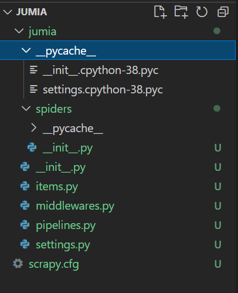

# Crawler En Python
Crawler signifie littéralement « scanner ». Autrement dit, il s’agit d’extraire un maximum d’informations possibles d’un site web. Cette analyse permet ainsi de connaître parfaitement la structure d’un site et de résoudre ses problèmes éventuels. Par exemple, une arborescence mal construite, un maillage interne inadéquat ou encore des balises meta dupliquées.

## Création D'un Projet Crawl 
Avant de créer le projet, il faut s’assurer d’avoir Scrapy installé. Utilisez la ligne de commande suivante pour l’installer : 
<code>
pip install scrapy
</code> Ou avec conda : 
<code>
conda install -c conda-forge scrapy
</code> 
Maintenant nous pouvons générer notre projet avec la ligne de commande suivante : 
<code>scrapy startproject jumia</code> 
**“jumia”** est le nom du projet, mais on pourrait l'appeler comme bon nous semble.

### Un Dossier jumia est créé.

### scrapy.py
La racine du projet contient le fichier scrapy.cfg qui est un fichier de configuration qui contient des variables telles que le nom du module qui contient les paramètres du projet et d’autres variables de déploiement.
### &#95;&#95;init&#95;&#95;.py
La racine contient un autre dossier datasets qui contient le projet en lui même. Ce dossier qui est un package Python (d’où le __init__.py) contient le package spiders (qui pour l’heure est vide) ainsi que les modules : **items**, **middlewares**, **pipelines** et **settings**.